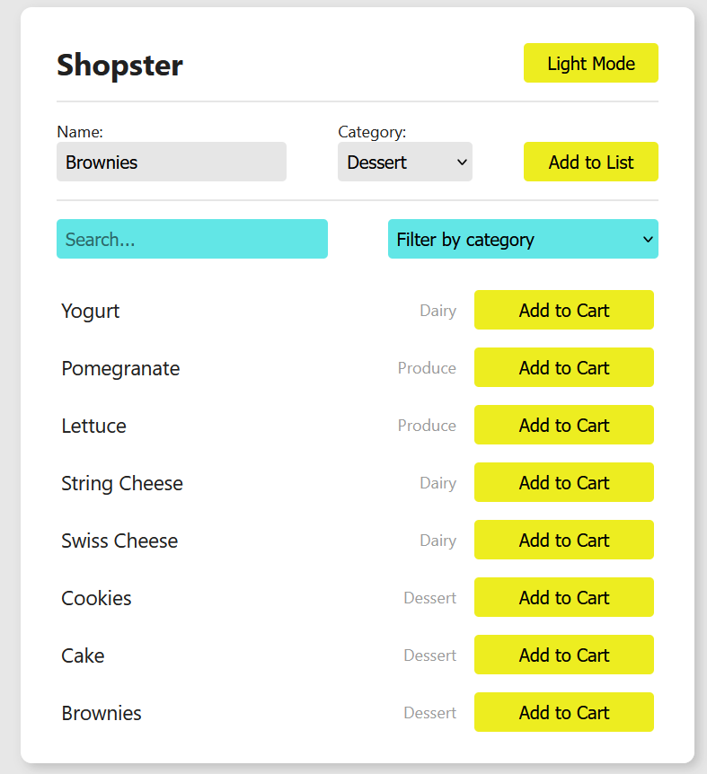
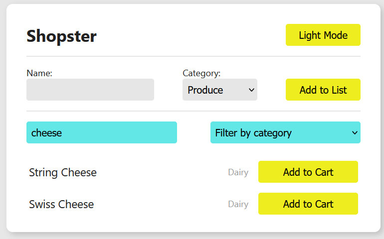

# React Controlled Components Lab

## Project Description

Shopster is a small React + Vite shopping list application. It displays a
list of grocery items that can be filtered by category and by a search term,
and lets the user add new items to the list through a controlled form. Each
item can be toggled in or out of the cart, and the app supports a light/dark
mode toggle.

## Setup Instructions

1. Clone this repository and navigate into the project folder.
2. Install dependencies:

   ```sh
   npm install
   ```

3. Start the development server:

   ```sh
   npm run dev
   ```

4. Open the URL printed in the terminal (typically `http://localhost:5173`)
   in your browser to view the app.

## Running the Tests

This project uses [Vitest](https://vitest.dev/) along with React Testing
Library. To run the test suite:

```sh
npm test
```

This will run all test files in `src/__tests__` and report whether the
`Filter` and `ItemForm` components behave as expected.

## Screen shots

Adding Items to Cart


Searching Items


## Learning Goals

- Implement a controlled form

## Introduction

In this lab, you'll write and use controlled components.

## Controlled Components

Now that we know how to handle form elements in React and how to set up
controlled components, it's time to put that knowledge to the test. This lab is
fairly extensive, but you'll use many core React concepts here that will surface
again and again. Time to get some practice in!

We'll continue adding new features to the Shopping List app using controlled
components. Make sure to familiarize yourself with the code before diving into
the deliverables! Completing these deliverables will also require understanding
of all the previous topics from this section, including initializing state,
passing data and callback functions as props, and working with events.

## Deliverables

### Filter

In the filter component, there is a new input field for searching our list.
_When the user types in this field_, the list of items should be filtered so
that only items with names that match the text are included.

- Determine where you need to add state for this feature. What components need
  to know about the search text?

- Once you've determined which component should hold the state for this feature,
  set up your initial state, and connect that state to the input field.
  Remember, we're trying to make this input a _controlled_ input — so the
  input's value should always be in sync with state.

- After you've connected the input to state, you'll also need to find a way to
  _set_ state when the input _changes_. To get the test passing, you'll need to
  use a prop called `onSearchChange` as a callback.

- Finally, after making those changes, you'll need to use that state value to
  determine which items are being displayed on the page, similar to how the
  category dropdown works.

**Note**: you may be asking yourself, why are we making this input controlled
when the `<select>` element is not a controlled input? Well, the `<select>`
input should probably be controlled as well! The tests don't require it, but
feel free to update the `<select>` element to be a controlled element.

### ItemForm

There is a new component called `ItemForm` that will allow us to add new items
to our shopping list. _When the form is submitted_, a new item should be created
and added to our list of items.

- Make all the input fields for this form controlled inputs, so that you can
  access all the form data via state. When setting the initial state for the
  `<select>` tag, use an initial value of "Produce" (since that's the first
  option in the list).

- Handle the form's _submit_ event, and use the data that you have saved in
  state to create a new item object with the following properties:

  ```jsx
  const newItem = {
    id: uuid(), // the `uuid` library can be used to generate a unique id
    name: itemName,
    category: itemCategory,
  };
  ```

- Add the new item to the list by updating state. To get the test passing,
  you'll need to use a prop called `onItemFormSubmit` as a callback and pass the
  new item to it.

  **NOTE**: to add a new element to an array in state, it's a good idea to use
  the spread operator:

  ```jsx
  function addElement(element) {
    setArray([...array, element]);
  }
  ```

  The spread operator allows us to copy all the old values of an array into a
  new array, and then add new elements as well. When you're working with state,
  it's important to pass a _new_ array to the state setter function instead of
  mutating the original array.

## Resources

- [React Forms](https://facebook.github.io/react/docs/forms.html)
